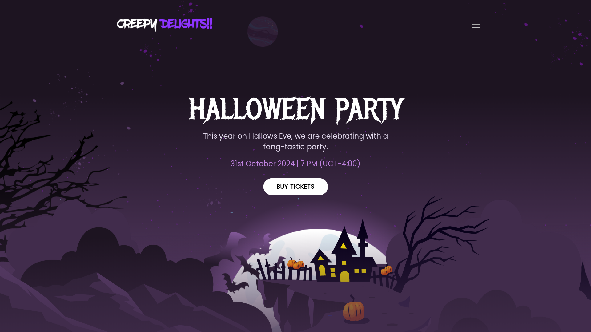
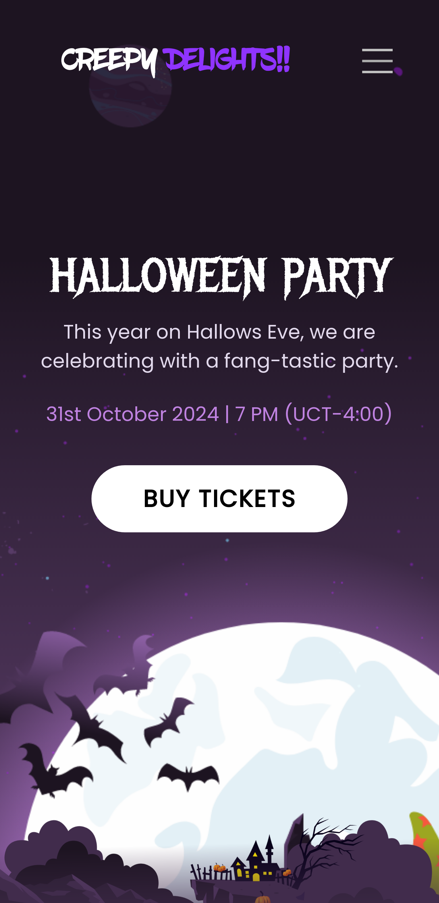

<div align="center">
  
  
  
  

  <br />
  <br />

  <h2 align="center">Creepy Delights 🎃</h2>

  Creepy Delights is a fully responsive website, <br />Responsive for all devices, build using HTML, and CSS.

  <a href="https://creepydelights.github.io"><strong>➥ Live Demo</strong></a>

</div>

<br />

### Demo Screeshots





### Prerequisites

Before you begin, ensure you have met the following requirements:

* [Git](https://git-scm.com/downloads "Download Git") must be installed on your operating system.

### Run Locally

To run **Creepy Delights** locally, run this command on your git bash:

Linux and macOS:

```bash
sudo git clone https://github.com/CreepyDelights/creepydelights.github.io.git
```

Windows:

```bash
git clone https://github.com/CreepyDelights/creepydelights.github.io.git
```

### Contact

If you want to contact with me you can reach me at [Telegram](https://t.me/TheHamkerGuy).

### License

This project is licensed under the [MIT LICENSE](https://github.com/CreepyDelights/CreepyDelights.github.io/blob/beb7b5b8bed88c289f0e404c84a429f8ef74a357/LICENSE). See the LICENSE file for more.
